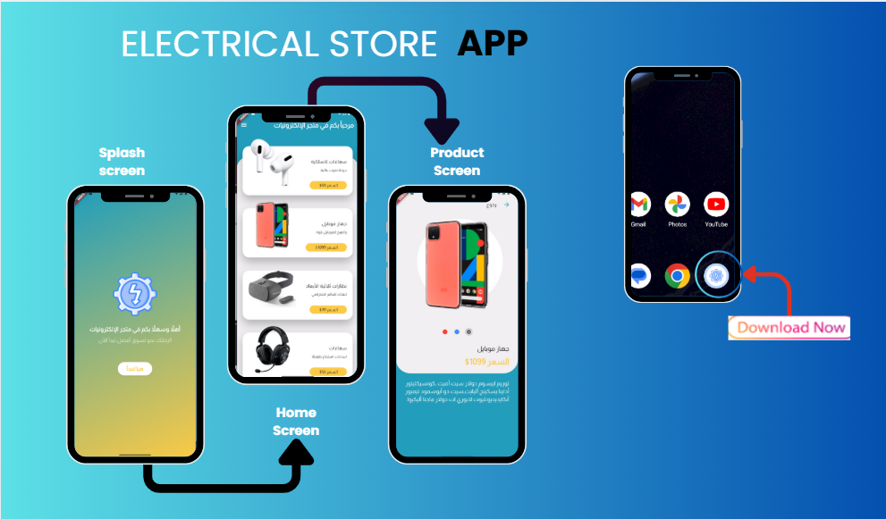

# 📱 Electrical Store App - Flutter  

ElectricaStoreApp is a modern Flutter application built with **Material Design** principles.  
 
---

## 📌 Widgets Used  
- **MaterialApp** → The root of the app with Material Design styling.  
- **Scaffold** → Provides the base layout with AppBar, Body, and more.  
- **AppBar** → Displays the top navigation bar with actions and title.  
- **CircleAvatar** → Perfect for profile images and social icons.  
- **Text** → Displays names, descriptions, and labels.  
- **Row & Column** → Align elements horizontally and vertically.  
- **Container** → Adds styling, background, and spacing.  
- **Icon** → Interactive icons like call, share, and message.  
- **TextButton** → For actions like "Contact Us".  
- **SingleChildScrollView** → Makes content scrollable on smaller devices.  
- **Stack** → Overlays widgets, e.g., profile image over background.  
- **ListTile** → Pre-styled rows with icons, titles, and trailing actions.  
- **BoxDecoration & BoxShadow** → Customizes visuals with rounded corners and shadows.  

---
## 📷 Screens 
  
